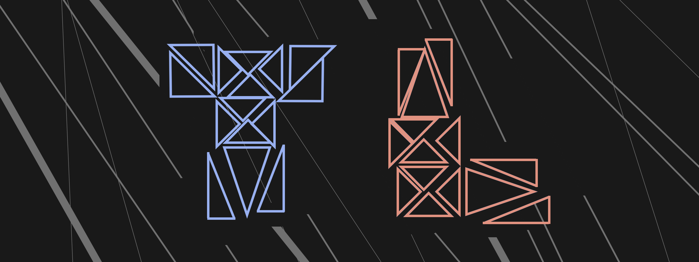

============
todolodo.xyz
============

.. meta::
    :description: Web Portfolio
    :key: TodoLodo, Todo Lodo, todolodo.xyz, Todo

.. image:: https://img.shields.io/endpoint?url=https://todolodo.xyz/status
    :align: center
    :target: https://vercel.com/todo2000

Description
-----------

This is my personal web portfolio.

Made With
~~~~~~~~~

..  raw:: html

    <ul style="font-weight: bold;">
        <li>
            

                HTML
                &nbsp;
                
            

        </li>
        <li>
            

                CSS
                &nbsp;
                
            

        </li>
        <li>
            

                JavaScript
                &nbsp;
                
            

        </li>
        <li>
            

                Flask
                &nbsp;
                
            

        </li>
    </ul>
    
